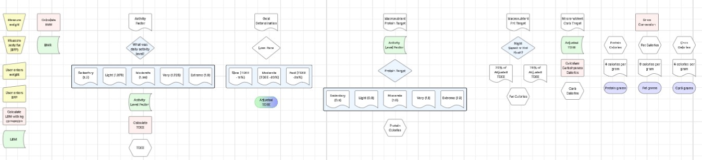
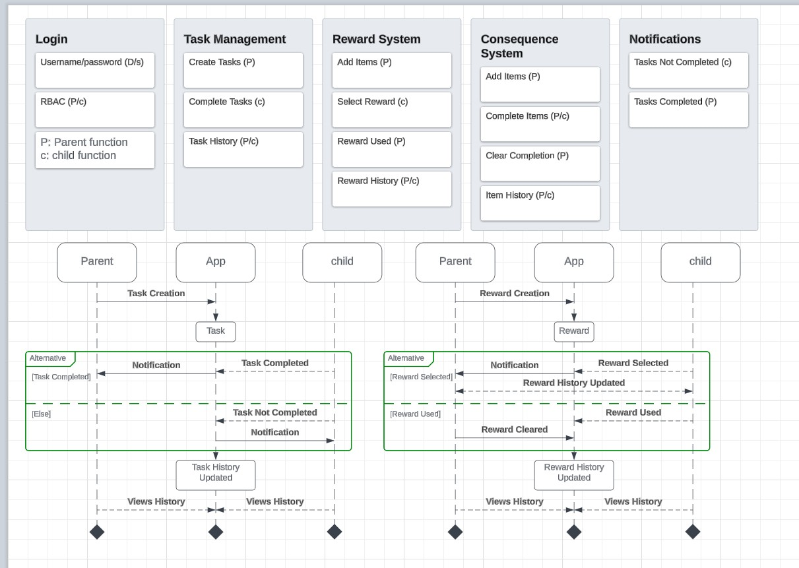

# Jennie Mabb | Management & Process Analysis Portfolio
A collection of architectural blueprints and data migration specifications focusing on structural logic, auditability, and stakeholder-driven design.

Jennie Mabb, M.S.
Senior Management Analyst | Process & Data Integrity Specialist
Specializing in Requirements Elicitation, Strategic Architecture, and Operational Governance

A results-driven Analyst with 15+ years of experience in high-security federal (DOJ) and international financial (ABN AMRO) environments. I specialize in the 'Structural Integrity of Information' — bridging the gap between complex business needs and technical execution through meticulous documentation and logical modeling.

I leverage a Master of Science in Mental Health Counseling to provide advanced stakeholder elicitation, conflict resolution, and human-centered design, ensuring that technical systems are built to serve the mission and the user.

🛠 Strategic Deliverables & Case Studies
### [Functional Requirements Design (NTS)](./NTS_Functional_Requirements_Design.pdf)
The Objective: Transform a manual driver education process into a secure, cloud-based platform.

Key Deliverable: Authored a 100+ point Functional Requirements Document (FRD) covering system logic, performance benchmarks, and security protocols.

Focus Areas: Role-Based Access Control (RBAC), Data Auditing, and Plain-Language Technical Writing.

### [Strategic Architectural Analysis](./Software_Design_Project_Mabb.pdf)
The Objective: Evaluate design constraints for transitioning local gaming environments to distributed web-based platforms.

Key Deliverable: Developed a platform recommendation white paper comparing Linux, Windows, and MacOS environments for scalability and cost-efficiency.

Focus Areas: Platform Evaluation, Distributed Systems, and Kotlin/Cross-platform strategy.

### [Regulatory Compliance: GDPR White Paper](./White_Paper_ANN_GDPR_Mabb.pdf)
The Objective: Analyze the impact of international privacy laws on Artificial Neural Networks (ANN) and personalization engines.

Key Deliverable: A formal analysis of "Privacy by Design," addressing Right to Erasure and Data Portability within automated systems.

Focus Areas: GDPR, International Data Privacy Law, and Risk Mitigation.

### [Database Architecture & Migration Spec](./MySQL_Data_Integrity_and_Migration_Specification_Mabb.pdf)
The Objective: Oversee a large-scale database overhaul involving 37,994 records and structural renaming.

Key Deliverable: Documented a full migration path in MySQL, focusing on Referential Integrity and data type standardization to prevent loss during transformation.

Focus Areas: SQL (MySQL), Relational Logic, and Audit-Ready Record Verification.

### [UML System Logic & UX Modeling](./NTS_UML_System_Designs_Mabb.pdf)
The Objective: Visualize "Actor" interactions and complex system workflows to prevent operational bottlenecks.

Key Deliverable: Developed Sequence Diagrams, Activity Maps, and UI Logic Workflows for inventory and task management systems.

Focus Areas: UML Modeling, Decision Logic, and User Experience (UX) Strategy.

Additional Designs:

Core Competencies
Methodology: SDLC, Agile Requirements Gathering, Operational Diagnostics.

Technical Literacy: SQL (MySQL), UML Modeling (Lucid/Visio), System Architecture Analysis.

Interpersonal: Advanced Clinical Elicitation, Stakeholder Management, Conflict De-escalation.

Professional Contact
Email: jennie.mabb18@gmail.com
Location: Virginia (Remote-preferred)
Eligibility: Public Trust (DOJ)
