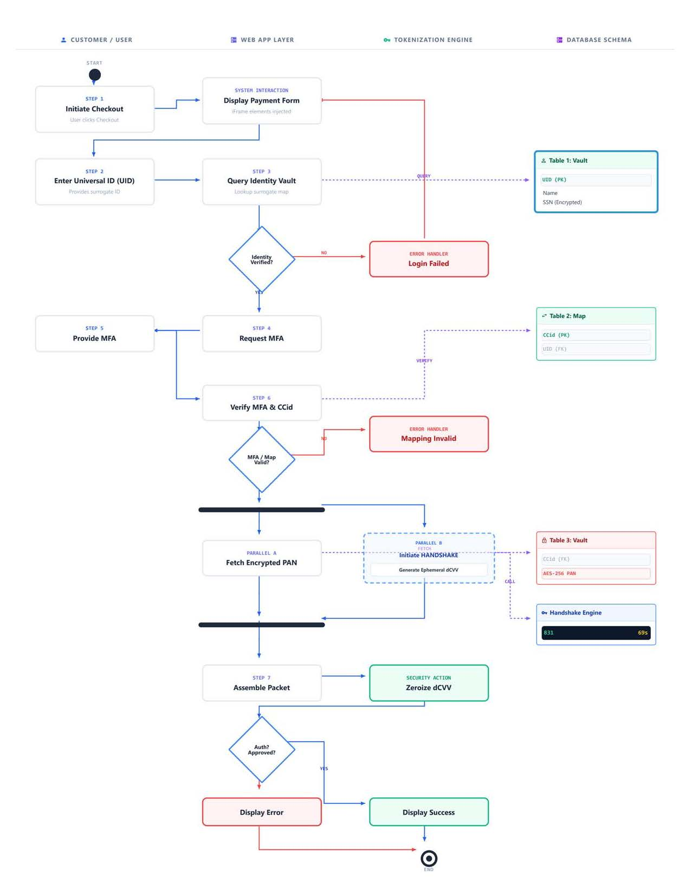
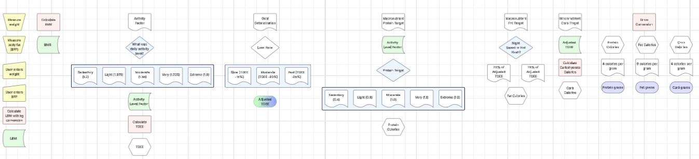
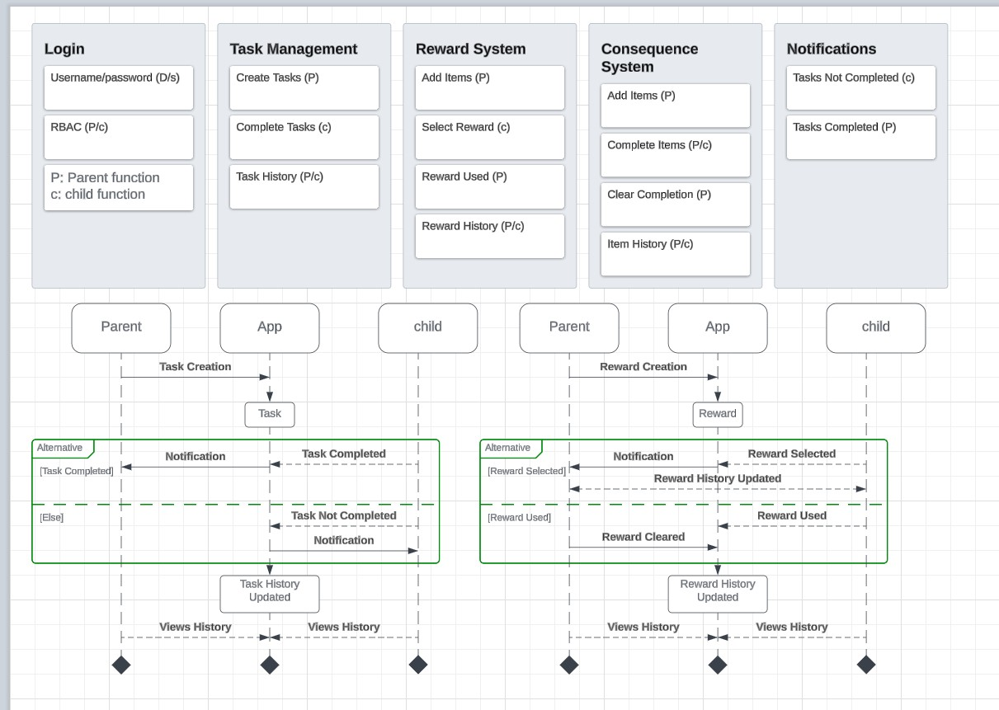

# Jennie Mabb, M.S.
### Senior Management Analyst | Process & Data Integrity Specialist
**Specializing in Requirements Elicitation, Strategic Architecture & Operational Governance**

[-0052CC)](#)
[-informational)](#)

---

## Executive Summary

Accomplished Senior Analyst with **10+ years of experience** navigating high-trust, heavily regulated environments—including **Federal Justice, Sovereign Tribal Governments, Institutional Facilities, and Global Banking**. 

* **Audit & Compliance Excellence:** Certified **ISO 27001 Lead Implementer** with a track record of maintaining **100% audit accuracy** across complex state and federal compliance frameworks (PCI DSS v4.0.1, GDPR, CJIS).
* **Bridging Business & Tech:** Proven ability to translate high-level executive objectives into rigorous technical deliverables—spanning **UML process workflows**, **SQL relational integrity**, and **100+ point Functional Requirements Documents (FRDs)**.
* **Human-Centered Systems Design:** Leveraging a **Master of Science in Mental Health Counseling** to provide an uncommon edge in advanced stakeholder elicitation, cross-functional conflict de-escalation, and behavioral data modeling.

---

## Core Competencies

| Domain | Key Strengths & Tooling |
| :--- | :--- |
| **Governance & Compliance** | ISO 27001, PCI DSS v4.0.1, GDPR (Data Minimization / Privacy by Design), Audit Trails & Controls |
| **Analysis & Modeling** | SDLC, Agile Requirements Elicitation, UML (Sequence Diagrams, Activity Maps), FRD/BRD Authoring |
| **Data & Architecture** | SQL (MySQL), Relational Schema Design, Referential Integrity, Ephemeral State Systems, Tokenization |
| **Human & Operational Dynamics** | Clinical Elicitation, Executive Stakeholder Alignment, Root-Cause Diagnostics, Conflict Resolution |

---

## Strategic Deliverables & Case Studies

### 1. Regulatory Governance & Cryptographic Architectures

#### **Stateless Tokenization & CDE Partitioning Engine**
* **Artifacts:** [Tokenization Architecture Board](./PCI-DSS_Tokenization_Architect_Board.jpg) • [Compliance Translation Matrix](./PCI-DSS_GDPR_Compliance_Translation_Matrix.pdf) • [Matrix Scope](./PCI-DSS_GDPR_Compliance_Translation_Matrix_Scope.pdf)
* **Objective:** Design a decoupled database schema and stateless cryptographic engine to eliminate Sensitive Authentication Data (SAD) persistence and radically minimize the PCI DSS audit footprint.
* **Key Architecture:**
  * **Identity Vault (`Table 1`):** PII isolated and keyed via surrogate keys (`UID`).
  * **Account Mapping Layer (`Table 2`):** Decoupled translation bridge between profiles and card indexes (`CCid`).
  * **Prescriptive CDE (`Table 3`):** Hardened vault containing encrypted PANs acting as the primary audit boundary.
  * **Ephemeral Handshake:** Implemented cryptographic randomizers producing dynamic CVVs (dCVVs) with strict 90-second expirations in volatile memory.
* **Framework Alignment:** PCI DSS v4.0.1 (Strict SAD non-persistence post-auth); GDPR Article 32 (Pseudonymization & Data Minimization).

#### **Artificial Neural Networks & International Privacy Law**
* **Artifact:** [GDPR White Paper: Privacy by Design in Automated Systems](./White_Paper_ANN_GDPR_Mabb.pdf)
* **Objective:** Evaluate the systemic friction between continuous machine learning / personalization engines and statutory privacy mandates.
* **Key Deliverables:** Formal legal-technical analysis assessing **Right to Erasure** and **Data Portability** inside non-linear learning models, establishing verifiable controls for algorithmic audit readiness.

---

### 2. Functional Requirements & Platform Engineering

#### **Cloud Platform Modernization — Driver Education System**
* **Artifact:** [Functional Requirements Document (NTS)](./NTS_Functional_Requirements_Design.pdf)
* **Objective:** Lead the requirements lifecycle transforming a fragmented legacy manual workflow into a secure, scalable cloud architecture.
* **Key Deliverables:** Authored an exhaustive **100+ point FRD** defining granular Role-Based Access Control (RBAC), end-to-end data auditing, state-transition rules, and plain-language technical user documentation.

#### **Distributed Architecture Evaluation**
* **Artifact:** [Strategic Architectural Analysis White Paper](./Software_Design_Project_Mabb.pdf)
* **Objective:** Comparative architectural trade-off analysis for transitioning standalone local gaming/simulation environments to distributed, web-enabled infrastructure.
* **Key Deliverables:** Multi-environment benchmark comparing Linux, Windows, and macOS ecosystems focusing on horizontal scalability, runtime cost efficiency, and cross-platform Kotlin delivery.

---

### 3. Data Architecture, Migrations & Interactive Systems

#### **Large-Scale Enterprise Database Overhaul**
* **Artifact:** [MySQL Data Integrity & Migration Specification](./MySQL_Data_Integrity_and_Migration_Specification_Mabb.pdf)
* **Objective:** Direct a zero-loss schema overhaul and structural re-indexing encompassing **37,994 operational records**.
* **Key Deliverables:** Formalized a staged migration runbook enforcing referential integrity, standardized data types across legacy disparities, and established pre/post-migration automated checksum verification routines.

#### **Real-Time Financial Transaction & Schema Simulator**
* **Artifacts:** [Interactive Schema Canvas (ERD)](./Credit_Card_Bonuses_database_schema_flow_visualizer.html) • [Core Flow Visualizer](./Credit_Card_Bonuses_process_flow_visualizer.html)
* **Objective:** Interactive simulation suite modeling real-time transaction ingestion, validation rules, and schema boundary enforcement.
* **Key Deliverables:** Coordinate-aware dynamic SVG visualizer enforcing strict $1:1$ and $1:N$ integrity constraints, operational latency reduction rules, and live SQL command trace outputs.

#### **System Logic & Actor Workflows**
* **Artifact:** [UML System Logic & UX Modeling Specification](./NTS_UML_System_Designs_Mabb.pdf)
* **Objective:** Prevent operational bottlenecks and user-journey fragmentation prior to sprint development.
* **Key Deliverables:** Complete UML suite comprising Sequence Diagrams, Activity Maps, and UI state machines for inventory tracking and administrative task delegation.

---

## Architectural Blueprints & Workflows

<b>Click to expand / collapse blueprint previews</b>

 

| Blueprint | Description |
| :--- | :--- |
| **PCI-DSS Stateless Tokenization Board**  | Decoupled CDE boundaries and 90-second ephemeral session state logic. |
| **TDEE Logic Workflow**  | Algorithmic logic and conditional branching model for metabolic calculations. |
| **Habit Engine Architecture**  | High-level behavioral process model and data persistence flow. |

---

## Professional Profile & Contact

* **Email:** [jennie.mabb18@gmail.com](mailto:jennie.mabb18@gmail.com)
* **Location:** Virginia (Open to Remote & Hybrid roles)
* **Clearance / Trust:** Public Trust (U.S. Department of Justice)
* **Status:** Available for Senior Analyst, Systems Architect, or Governance/Compliance advisory positions.
